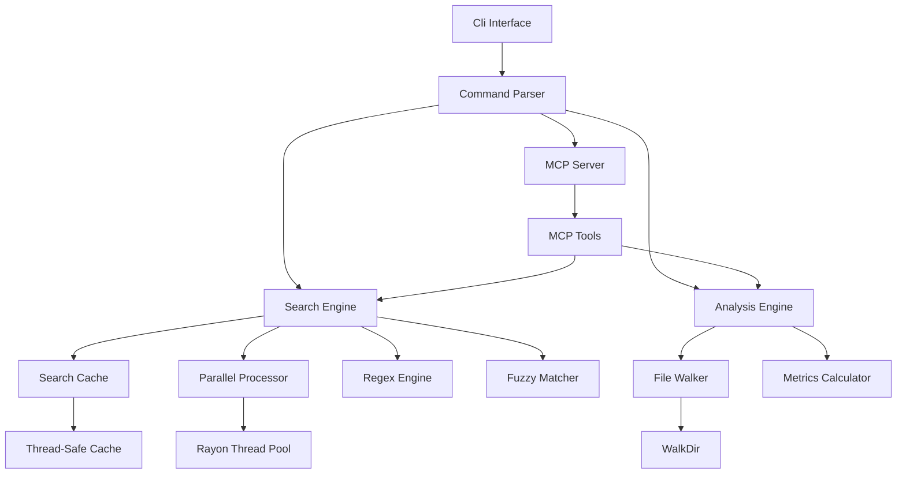
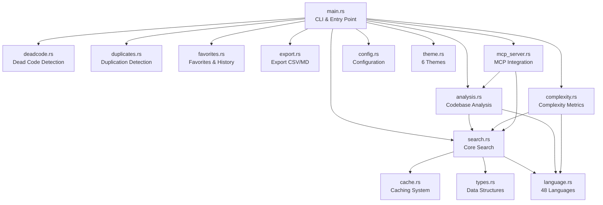
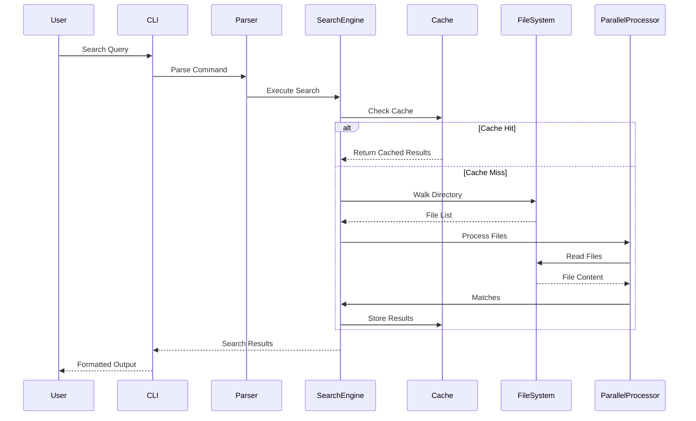

# Architecture

## Overview

Code Search is a CLI tool built in Rust that provides fast, intelligent code searching capabilities. The architecture is designed for performance, maintainability, and extensibility.

## System Architecture



## Module Structure



### Module Descriptions (19 modules, ~6000+ LOC total)

| Module | Lines | Description |
|--------|-------|-------------|
| `main.rs` | 699 | CLI entry point, interactive mode |
| **`deadcode/`** | **685** | **Enhanced dead code detection (modularized)** |
| ├─ `mod.rs` | 200 | Main detection logic and public API |
| ├─ `detectors.rs` | 340 | Individual detection functions (6+ types) |
| ├─ `helpers.rs` | 130 | Utility functions and validators |
| └─ `types.rs` | 15 | Data structures (DeadCodeItem) |
| `search.rs` | 645 | Core search engine, parallel processing |
| `language.rs` | 510 | 48 language definitions with patterns |
| `analysis.rs` | 418 | Codebase metrics, refactoring suggestions |
| `mcp_server.rs` | 375 | MCP server integration |
| `complexity.rs` | 308 | Cyclomatic & cognitive complexity |
| `duplicates.rs` | 196 | Code duplication detection |
| `favorites.rs` | 199 | Favorites and search history |
| `export.rs` | 185 | CSV and Markdown export |
| `config.rs` | 183 | Configuration file support |
| `theme.rs` | 179 | 6 output themes |
| `parser.rs` | 176 | Code parsing utilities |
| `cache.rs` | 125 | Thread-safe search cache |
| `types.rs` | 112 | Shared data structures |

## Data Flow



## Core Components

### 1. CLI Interface (`main.rs`)

**Responsibilities:**
- Command-line argument parsing using `clap`
- Command routing to appropriate handlers
- Output formatting (text/JSON)
- User interaction (interactive mode, favorites)

**Key Structures:**
- `Cli`: Main CLI parser structure
- `Commands`: Enum of available commands
- `SearchResult`, `Match`, `FileInfo`: Data structures for results

### 2. Search Engine (`search_code`)

**Responsibilities:**
- Pattern matching (regex, fuzzy, exact)
- Parallel file processing
- Relevance scoring
- Result ranking and filtering

**Key Functions:**
- `search_code()`: Main search entry point
- `search_in_file_parallel()`: Parallel file search
- `calculate_relevance_score()`: Relevance calculation
- `enhance_query_semantically()`: Query enhancement

**Performance Features:**
- Parallel processing with `rayon`
- Thread-safe caching with `DashMap`
- Streaming file reading for large files

### 3. Caching System (`SearchCache`)

**Responsibilities:**
- Query result caching
- File modification tracking
- Cache invalidation
- Performance optimization

**Implementation:**
- Uses `DashMap` for thread-safe concurrent access
- Tracks file modification times
- Cache key includes: query, path, extensions, fuzzy flag

### 4. Analysis Engine (`analyze_codebase`, `suggest_refactoring`)

**Responsibilities:**
- Codebase metrics calculation
- Code quality analysis
- Refactoring suggestions
- File statistics

**Key Functions:**
- `analyze_codebase()`: Overall codebase analysis
- `analyze_file_for_refactoring()`: File-level analysis
- `suggest_refactoring()`: Refactoring recommendations

### 5. Dead Code Detection Engine (`deadcode/`)

**Modular Structure** (following SoC and KISS principles):

The dead code detection module has been refactored into focused sub-modules:

```
deadcode/
├── mod.rs          # Main detection logic, orchestration, output formatting
├── detectors.rs    # Individual detection functions (6+ detection types)
├── helpers.rs      # Utility functions, validators, string operations
└── types.rs        # Data structures (DeadCodeItem)
```

**Responsibilities:**
- Detect unused variables and constants
- Identify unreachable code after return statements
- Find empty functions (supports brace-based and indentation-based languages)
- Flag TODO/FIXME/HACK/XXX/BUG markers
- Detect commented-out code
- Identify unused imports

**Key Functions:**

*In `mod.rs`:*
- `detect_dead_code()`: CLI entry point with formatted output
- `find_dead_code()`: Main detection orchestration
- `print_dead_code_results()`: Result formatting

*In `detectors.rs`:*
- `detect_unused_variables()`: Variable usage analysis
- `detect_unreachable_code()`: Control flow analysis
- `detect_empty_functions()`: Empty function detection (multi-language)
- `detect_todo_fixme()`: Marker detection
- `detect_dead_code_patterns()`: Pattern-based detection

*In `helpers.rs`:*
- `is_special_function()`: Function name validation
- `is_commented_out_code()`: Code comment detection
- `extract_import_name()`: Import statement parsing
- `truncate_string()`: String formatting

**Detection Types:**
- **Unused Variables**: Detects `let`, `const`, `var`, `:=`, `<-` patterns
- **Unreachable Code**: Identifies code after return statements
- **Empty Functions**: Handles both `{}` and `:` (Python) syntax
- **TODO Markers**: Finds TODO, FIXME, HACK, XXX, BUG comments
- **Commented Code**: Detects commented-out function/variable declarations
- **Unused Imports**: Tracks import usage across files

**Benefits of Modularization:**
- **Maintainability**: Each sub-module has a single, clear responsibility
- **Testability**: Tests are co-located with their respective modules
- **Extensibility**: New detection types can be added to `detectors.rs` without affecting other code
- **Readability**: Smaller files (~130-340 LOC each) are easier to understand

### 6. MCP Server (`mcp_server.rs`)

**Responsibilities:**
- Expose code search as MCP tools
- JSON schema generation
- Tool routing and handling
- Integration with AI assistants

**Tools Exposed:**
- `search_code`: Search functionality
- `list_files`: File listing
- `analyze_codebase`: Codebase analysis
- `suggest_refactoring`: Refactoring suggestions

## Data Structures

### SearchResult
```rust
pub struct SearchResult {
    pub file: String,
    pub matches: Vec<Match>,
    pub line_count: usize,
    pub relevance_score: f64,
}
```

### Match
```rust
pub struct Match {
    pub line_number: usize,
    pub content: String,
    pub context: Option<String>,
}
```

### FileInfo
```rust
pub struct FileInfo {
    pub path: String,
    pub size: u64,
    pub lines: usize,
}
```

### SearchCache
```rust
struct SearchCache {
    cache: DashMap<String, (Vec<SearchResult>, SystemTime)>,
    file_timestamps: DashMap<String, SystemTime>,
}
```

## Performance Optimizations

### Parallel Processing
- Uses `rayon` for parallel file processing
- Automatically scales to available CPU cores
- Thread-safe operations throughout

### Caching Strategy
- Query-based caching with file modification tracking
- Automatic cache invalidation on file changes
- Memory-efficient storage

### Memory Management
- Streaming file reading (doesn't load entire files)
- Efficient data structures (`DashMap`, `ahash`)
- Lazy evaluation where possible

## Error Handling

- Uses `anyhow` for error propagation
- Uses `thiserror` for custom error types
- Graceful handling of file access errors
- Continues processing on individual file errors

## Testing Architecture

### Unit Tests (49+ tests across modules)
- Each module contains its own unit tests
- Located in respective module files (`search.rs`, `analysis.rs`, etc.)
- Test individual functions in isolation
- Use temporary directories for file operations

### Integration Tests
- Located in `tests/integration_tests.rs` (26 tests)
- Test CLI commands end-to-end
- Verify output format and behavior

### Dead Code Detection Tests (11 tests)
- `test_detect_unused_variables`: Variable usage tracking
- `test_detect_unreachable_code`: Control flow analysis
- `test_detect_empty_functions`: Multi-language empty function detection
- `test_detect_todo_fixme`: Marker detection
- `test_multi_language_support`: Python/Rust compatibility
- Additional tests for edge cases and patterns

## Dependencies

### Core Dependencies
- `clap`: CLI argument parsing
- `regex`: Pattern matching
- `walkdir`: Directory traversal
- `serde`/`serde_json`: Serialization

### Performance Dependencies
- `rayon`: Parallel processing
- `dashmap`: Thread-safe hash maps
- `ahash`: Fast hashing
- `fuzzy-matcher`: Fuzzy search

### Optional Dependencies
- `rmcp`: MCP server support
- `tokio`: Async runtime (for MCP)
- `schemars`: JSON schema generation (for MCP)

## Extension Points

### Adding New Commands
1. Add variant to `Commands` enum
2. Implement handler function
3. Add CLI argument parsing

### Adding New Search Features
1. Extend `search_code` function
2. Add new scoring factors to `calculate_relevance_score`
3. Update cache key generation if needed

### Adding MCP Tools
1. Define parameter struct with `JsonSchema`
2. Implement tool function in `mcp_server.rs`
3. Register with `tool_router`

## Build Configuration

- **Rust Edition**: 2024
- **Default Features**: None (minimal dependencies)
- **Optional Features**: `mcp` (MCP server support)
- **Target**: Native binary (CLI-only, no WASM)
- **MSRV**: Rust 1.70+ (for latest language features)

## Design Patterns Used

### Structural Patterns
- **Module Pattern**: Clear separation of concerns across 19+ modules
- **Facade Pattern**: Simplified API in `main.rs` wrapping complex subsystems
- **Composite Pattern**: Graph structures compose nodes and edges

### Behavioral Patterns
- **Strategy Pattern**: Different search strategies (regex, fuzzy, semantic)
- **Observer Pattern**: File watcher notifies index of changes
- **Iterator Pattern**: Streaming file reading for memory efficiency

### Concurrency Patterns
- **Thread Pool**: Rayon for parallel file processing
- **Shared State**: DashMap for thread-safe caching
- **Message Passing**: Used in file watcher for event handling

## Metrics & Quality Gates

### Code Quality
- **Clippy Warnings**: 0 (all resolved as of Jan 2026)
- **Compiler Warnings**: 5 (non_snake_case for Halstead metrics - intentional)
- **Test Pass Rate**: 100% (173 unit + 36 integration tests)
- **Module Count**: 19 focused modules
- **Average Module Size**: ~200 LOC (well within maintainable range)

### Performance Targets
- **Search Latency**: < 50ms for typical queries (< 1000 files)
- **Memory Usage**: < 100MB for moderate codebases (< 10K files)
- **Parallel Efficiency**: 70%+ CPU utilization on multi-core systems
- **Cache Hit Rate**: 70-90% for repeated searches

### Test Coverage Goals
- **Unit Tests**: 80%+ coverage for core modules
- **Integration Tests**: All CLI commands covered
- **Edge Cases**: Empty files, large files, unicode, special characters
- **Performance Tests**: Regression detection for critical paths

## Code Quality & Design Principles

### Maintainability

The codebase follows these key principles:

**DRY (Don't Repeat Yourself)**
- Shared functionality extracted into utility modules
- Common patterns abstracted into reusable functions
- Type definitions centralized in `types.rs` modules

**KISS (Keep It Simple, Stupid)**
- Each module has a single, clear responsibility
- Functions are kept small and focused (typically < 100 LOC)
- Complex operations broken into composable steps

**Separation of Concerns (SoC)**
- Modular architecture with 19+ focused modules
- Clear boundaries between search, analysis, and presentation layers
- Sub-module pattern used in `deadcode/`, `codemetrics/`, `search/`, `language/`, `duplicates/`, `designmetrics/`

**Current Strengths:**
- ✅ Modular structure with focused sub-modules
- ✅ Consistent error handling with `Result` types
- ✅ Thread-safe operations using `Arc`, `DashMap`
- ✅ Parallel processing with `rayon`
- ✅ Comprehensive test coverage (173 unit tests, 36 integration tests)

**Areas for Improvement:**

1. **Trait Abstractions** (High Priority)
   - Current: Direct function calls, hard to mock
   - Proposed: Extract traits for `SearchEngine`, `Analyzer`, `GraphBuilder`
   - Benefits: Better testability, clearer contracts, easier to extend
   ```rust
   trait SearchEngine {
       fn search(&self, query: &str, options: &SearchOptions) -> Result<Vec<SearchResult>>;
   }
   ```

2. **Parameter Object Pattern** (High Priority)
   - Current: `search_code()` has 13 parameters (exceeds recommended 7)
   - Proposed: Bundle related parameters into structs
   ```rust
   struct SearchOptions {
       extensions: Option<Vec<String>>,
       fuzzy: bool,
       case_insensitive: bool,
       // ... other options
   }
   ```

3. **Custom Error Types** (Medium Priority)
   - Current: Generic `Box<dyn std::error::Error>`
   - Proposed: Specific error types using `thiserror`
   ```rust
   #[derive(Error, Debug)]
   enum SearchError {
       #[error("File not found: {0}")]
       FileNotFound(PathBuf),
       #[error("Invalid regex pattern: {0}")]
       InvalidPattern(String),
   }
   ```

4. **Module Size Management** (Low Priority)
   - `main.rs`: 624 LOC - consider extracting command handlers
   - `search/core.rs`: 215 LOC - consider splitting search logic from result processing
   - Target: Keep modules under 400 LOC for better maintainability

### Test-Friendliness

**Current Testing Architecture:**
- 173 unit tests across modules
- 36 integration tests (11 cross-file, 25 CLI integration)
- 23 MCP server tests
- Tests co-located with implementation code

**Strengths:**
- ✅ Good coverage of core functionality
- ✅ Integration tests verify end-to-end behavior
- ✅ Use of temporary directories for file operations
- ✅ Isolated test cases with no shared state

**Improvement Opportunities:**

1. **Dependency Injection** (High Priority)
   - Current: Direct file system access, hard to mock
   - Proposed: Trait-based file system abstraction
   ```rust
   trait FileSystem {
       fn read_file(&self, path: &Path) -> Result<String>;
       fn list_files(&self, path: &Path) -> Result<Vec<PathBuf>>;
   }
   
   struct RealFileSystem;
   struct MockFileSystem { /* test data */ }
   ```

2. **Pure Function Extraction** (High Priority)
   - Separate I/O operations from business logic
   - Make algorithms testable without file system
   - Example: Extract relevance scoring from file reading
   ```rust
   // Pure function - easy to test
   fn calculate_score(content: &str, query: &str) -> f64 { ... }
   
   // I/O wrapper - tested via integration tests
   fn score_file(path: &Path, query: &str) -> Result<f64> {
       let content = read_file(path)?;
       Ok(calculate_score(&content, query))
   }
   ```

3. **Property-Based Testing** (Medium Priority)
   - Use `proptest` for fuzzing search patterns
   - Test invariants (e.g., "search results always contain query")
   - Generate random code samples for analysis testing

4. **Test Coverage Reporting** (Medium Priority)
   - Integrate `tarpaulin` or `cargo-llvm-cov`
   - Target: 80%+ coverage for core modules
   - Track coverage trends in CI/CD

5. **Test Fixtures** (Low Priority)
   - Create reusable test data generators
   - Standardize common test scenarios
   - Reduce test code duplication

### Performance Optimization

**Current Performance Features:**
- ✅ Parallel file processing with `rayon`
- ✅ Thread-safe caching with `DashMap`
- ✅ Streaming file reading for large files
- ✅ Fast hashing with `ahash`
- ✅ Incremental indexing support
- ✅ File watching for real-time updates

**Measured Performance:**
- Typical search: 3-50ms for small codebases (< 1000 files)
- Parallel workers: Auto-scales to available CPU cores
- Cache hit rate: 70-90% for repeated searches

**Optimization Opportunities:**

1. **Hot Path Profiling** (High Priority)
   - Use `cargo flamegraph` to identify bottlenecks
   - Profile with realistic workloads (10K+ files)
   - Focus optimization on top 20% of time-consuming operations

2. **Memory Allocation Reduction** (High Priority)
   - Use `SmallVec` for small collections (< 8 items)
   - String interning for repeated file paths
   - Reuse buffers in hot loops
   - Use `Cow<str>` to avoid unnecessary cloning
   ```rust
   use smallvec::SmallVec;
   
   // Instead of Vec<Match> for typical 1-3 matches
   type Matches = SmallVec<[Match; 4]>;
   ```

3. **Regex Optimization** (Medium Priority)
   - Pre-compile common patterns at startup
   - Use `regex::RegexSet` for multiple pattern matching
   - Consider `aho-corasick` for literal string matching
   - Already fixed: Moved regex compilation outside loops ✅

4. **Caching Strategy Enhancement** (Medium Priority)
   - Add LRU eviction policy (prevent unbounded growth)
   - Cache parsed ASTs for frequently accessed files
   - Implement cache warming for common queries
   - Current: Simple time-based invalidation

5. **Parallel Processing Tuning** (Low Priority)
   - Tune rayon thread pool size based on workload
   - Use work-stealing for better load balancing
   - Consider async I/O for network operations (remote search)

6. **Benchmark Suite** (Low Priority)
   - Add criterion benchmarks for core operations
   - Track performance regressions in CI/CD
   - Compare against grep/ripgrep on standard datasets

## Future Architecture Considerations

### Short-Term (Next 3-6 months)
- **Trait Abstractions**: Extract core interfaces for better testability
- **Parameter Objects**: Reduce function parameter counts
- **Custom Error Types**: Improve error handling and debugging
- **Test Coverage**: Reach 80%+ coverage with property-based tests

### Medium-Term (6-12 months)
- **Workspace Crates**: Split into `codesearch-core`, `codesearch-cli`, `codesearch-mcp`
- **Performance Profiling**: Systematic optimization of hot paths
- **Documentation**: Complete rustdoc coverage with examples
- **Benchmarking**: Comprehensive performance test suite

### Long-Term (12+ months)
- **Plugin System**: Allow external search strategies and custom analyzers
- **Advanced Caching**: LRU eviction, AST caching, query warming
- **Async I/O**: For network operations and large file processing
- **ML Integration**: Pattern recognition and intelligent suggestions

