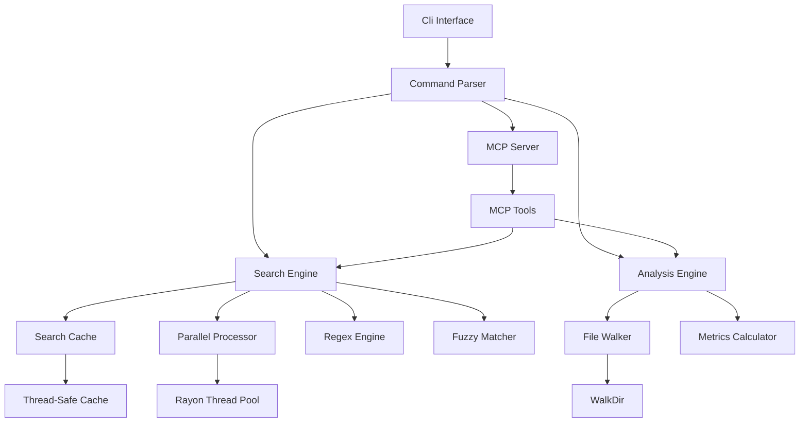
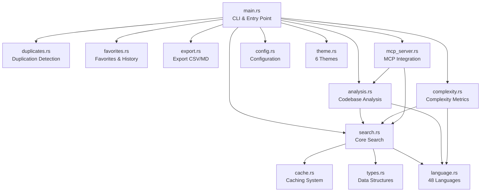
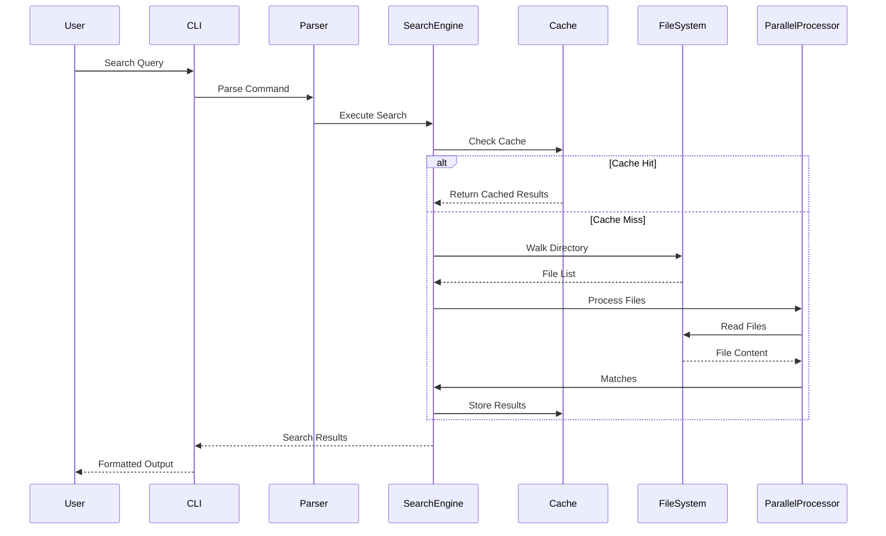

# Architecture

## Overview

Code Search is a CLI tool built in Rust that provides fast, intelligent code searching capabilities. The architecture is designed for performance, maintainability, and extensibility.

## System Architecture



## Module Structure



### Module Descriptions (13 modules, ~4100 LOC total)

| Module | Lines | Description |
|--------|-------|-------------|
| `main.rs` | 699 | CLI entry point, interactive mode |
| `search.rs` | 645 | Core search engine, parallel processing |
| `language.rs` | 506 | 48 language definitions with patterns |
| `analysis.rs` | 418 | Codebase metrics, refactoring suggestions |
| `mcp_server.rs` | 375 | MCP server integration |
| `complexity.rs` | 308 | Cyclomatic & cognitive complexity |
| `duplicates.rs` | 196 | Code duplication detection |
| `favorites.rs` | 199 | Favorites and search history |
| `export.rs` | 185 | CSV and Markdown export |
| `config.rs` | 183 | Configuration file support |
| `theme.rs` | 179 | 6 output themes |
| `cache.rs` | 125 | Thread-safe search cache |
| `types.rs` | 112 | Shared data structures |

## Data Flow



## Core Components

### 1. CLI Interface (`main.rs`)

**Responsibilities:**
- Command-line argument parsing using `clap`
- Command routing to appropriate handlers
- Output formatting (text/JSON)
- User interaction (interactive mode, favorites)

**Key Structures:**
- `Cli`: Main CLI parser structure
- `Commands`: Enum of available commands
- `SearchResult`, `Match`, `FileInfo`: Data structures for results

### 2. Search Engine (`search_code`)

**Responsibilities:**
- Pattern matching (regex, fuzzy, exact)
- Parallel file processing
- Relevance scoring
- Result ranking and filtering

**Key Functions:**
- `search_code()`: Main search entry point
- `search_in_file_parallel()`: Parallel file search
- `calculate_relevance_score()`: Relevance calculation
- `enhance_query_semantically()`: Query enhancement

**Performance Features:**
- Parallel processing with `rayon`
- Thread-safe caching with `DashMap`
- Streaming file reading for large files

### 3. Caching System (`SearchCache`)

**Responsibilities:**
- Query result caching
- File modification tracking
- Cache invalidation
- Performance optimization

**Implementation:**
- Uses `DashMap` for thread-safe concurrent access
- Tracks file modification times
- Cache key includes: query, path, extensions, fuzzy flag

### 4. Analysis Engine (`analyze_codebase`, `suggest_refactoring`)

**Responsibilities:**
- Codebase metrics calculation
- Code quality analysis
- Refactoring suggestions
- File statistics

**Key Functions:**
- `analyze_codebase()`: Overall codebase analysis
- `analyze_file_for_refactoring()`: File-level analysis
- `suggest_refactoring()`: Refactoring recommendations

### 5. MCP Server (`mcp_server.rs`)

**Responsibilities:**
- Expose code search as MCP tools
- JSON schema generation
- Tool routing and handling
- Integration with AI assistants

**Tools Exposed:**
- `search_code`: Search functionality
- `list_files`: File listing
- `analyze_codebase`: Codebase analysis
- `suggest_refactoring`: Refactoring suggestions

## Data Structures

### SearchResult
```rust
pub struct SearchResult {
    pub file: String,
    pub matches: Vec<Match>,
    pub line_count: usize,
    pub relevance_score: f64,
}
```

### Match
```rust
pub struct Match {
    pub line_number: usize,
    pub content: String,
    pub context: Option<String>,
}
```

### FileInfo
```rust
pub struct FileInfo {
    pub path: String,
    pub size: u64,
    pub lines: usize,
}
```

### SearchCache
```rust
struct SearchCache {
    cache: DashMap<String, (Vec<SearchResult>, SystemTime)>,
    file_timestamps: DashMap<String, SystemTime>,
}
```

## Performance Optimizations

### Parallel Processing
- Uses `rayon` for parallel file processing
- Automatically scales to available CPU cores
- Thread-safe operations throughout

### Caching Strategy
- Query-based caching with file modification tracking
- Automatic cache invalidation on file changes
- Memory-efficient storage

### Memory Management
- Streaming file reading (doesn't load entire files)
- Efficient data structures (`DashMap`, `ahash`)
- Lazy evaluation where possible

## Error Handling

- Uses `anyhow` for error propagation
- Uses `thiserror` for custom error types
- Graceful handling of file access errors
- Continues processing on individual file errors

## Testing Architecture

### Unit Tests (40+ tests across modules)
- Each module contains its own unit tests
- Located in respective module files (`search.rs`, `analysis.rs`, etc.)
- Test individual functions in isolation
- Use temporary directories for file operations

### Integration Tests
- Located in `tests/integration_tests.rs` (26 tests)
- Test CLI commands end-to-end
- Verify output format and behavior

## Dependencies

### Core Dependencies
- `clap`: CLI argument parsing
- `regex`: Pattern matching
- `walkdir`: Directory traversal
- `serde`/`serde_json`: Serialization

### Performance Dependencies
- `rayon`: Parallel processing
- `dashmap`: Thread-safe hash maps
- `ahash`: Fast hashing
- `fuzzy-matcher`: Fuzzy search

### Optional Dependencies
- `rmcp`: MCP server support
- `tokio`: Async runtime (for MCP)
- `schemars`: JSON schema generation (for MCP)

## Extension Points

### Adding New Commands
1. Add variant to `Commands` enum
2. Implement handler function
3. Add CLI argument parsing

### Adding New Search Features
1. Extend `search_code` function
2. Add new scoring factors to `calculate_relevance_score`
3. Update cache key generation if needed

### Adding MCP Tools
1. Define parameter struct with `JsonSchema`
2. Implement tool function in `mcp_server.rs`
3. Register with `tool_router`

## Build Configuration

- **Rust Edition**: 2024
- **Default Features**: None (minimal dependencies)
- **Optional Features**: `mcp` (MCP server support)
- **Target**: Native binary (CLI-only, no WASM)

## Future Architecture Considerations

- **Separate Crates**: Consider splitting into workspace crates for very large projects
- **Plugin System**: Allow external search strategies and custom analyzers
- **Incremental Indexing**: Add indexing for very large codebases (1M+ files)
- **AST-Based Analysis**: Move beyond regex to true syntax tree analysis
- **Remote Search**: Add support for searching in remote repositories

